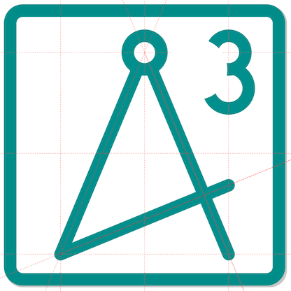

**A4cube**

    A4cube is an experimental all-electron DFT application.
    It is based on a various representations:
        real-space grids,
        plane waves and
        factorizable local orbitals.
    Furthermore, the Green functions formalism, near-sightedness
    for linear-scaling and the projector augmented wave method (PAW), 
    in particular the revised PAW methd (see Paul F. Baumeister and Shigeru Tsukamoto,
      proceedings of PASC'19, https://dl.acm.org/doi/10.1145/3324989.3325717)

**Name**
The name refers to a cube with edge length 1 Angstrom
which is abbreviated \AA in TeX code.
This is because always 4x4x4 real-space grid points are grouped
for performance which corresponds to roughly one \AA^3

**Principles**
The idea is to have a code that 
- is highly parallel
- can make use of GPUs
- does not require more input than the atomic coordinates
- can scale linearly

**Current Status**
- These features are planned but have so far not been addressed:
    - different versions of LDA, GGA, meta-GGA (currently only LDA implemented)
    - efficient eigensolver for the grid Hamiltonian (currently inefficient subspace rotation method)
    - MPI parallelization (currently none)
    - OpenMP parallelization (currently none)
    - GPU acceleration (currently none)
    - fancy boundary conditions (currently only periodic and isolated)
    - forces (currently none)
    - self-consistency convergence criteria (currently we set the number of iterations)
    - magnetism, collinear and non-collinear (currently none)
- These features are ready:
    - total energy
    - complex wave functions, ***k***-points
    - potential generation (currently only non-magnetic)
    - multigrid Poisson solver for the electrostatics (currently only serial)
    - SHO-projector PAW with all-electron atoms (currently only non-magnetic)
- Some features are build in only for development purposes:
    - a stable FFT Poisson solver for the electrostatic problem
    - plane wave basis set using a dense matrix eigensolver (LAPACK) or iterative (in development)
    - dense eigensolver for the real-space grid Hamiltonian
- These features are not intended to be implemented ever:
    - strain calculation
    - exact exchange
    - phonons

**Directories**
The root folder of this repository contains the following directories:
- bin       you can move your compiled executabales/libraries here but please do not git-add them
- data      matrix element files for CHO and SHO transforms between radial and Cartesian bases
- doc       documentation
- external  put third party libraries here
- green     source folder for the Green function executable ./green
- src       source folder for the generator executabale ./a43
- include   source folder for header files
- julia     experimental modules in the Julia programming language
- ref       reference output of certain unit tests
- test      test scripts for certain modules

**Abbreviations**
- SHO     Spherical Harmonic Oscillator
- CHO     Circular Harmonic Oscillator
- PAW     Projector Augmented Wave
- GPU     Graphical Processing Unit
- CPU     Central Processing Unit
- MPI     Message Passing Interface
- FFT     Fast Fourier Transform
- LDA     Local Density Approximation
- DFT     Density Functional Theory
- GGA     Generalized Gradient Approximation
- OpenMP  Open Multi-Processing
- TeX     typesetting
